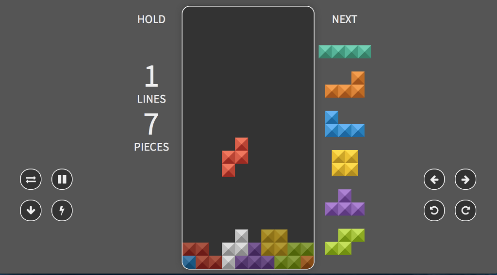

# Petris

A touch enabled Tetris built in JavaScript!

### [Check out the demo](http://petris.runesons.se/)

## Default Keyboard Controls:

- **Move Left**: Left Arrow
- **Move Right**: Right Arrow
- **Rotate Left**: Z
- **Rotate Right**: X
- **Rotate 180**: Shift
- **Hold**: C
- **Hard Drop**: Space
- **Pause**: Escape
- **Restart**: R

## Features

- Tetris Guideline compliant
    - Colors
    - Random generator, first bag never spawns Z, S, or O piece first.
    - SRS
    - Gameover by lock out or block out
    - Hold
    - Piece preview
- Game statistics like PPM, Time, etc.
- Multiple mino skins
- Stack outline
- Configurable gravity
- 60 FPS
- Fast code and drawing
- DAS and DAS delay settings
- Configurable controls
- Adjustable game size
- Ghost piece color and transparency
- Responsive design
- Preload das preservation during countdown
- Finesse faults counter.

## License

[Link to license document.](LICENSE.txt) (It's MIT)

## Credits

Petris is based on based on [tetr.js](https://github.com/simonlc/tetr.js) by Simon Laroche. Great work Simon!
